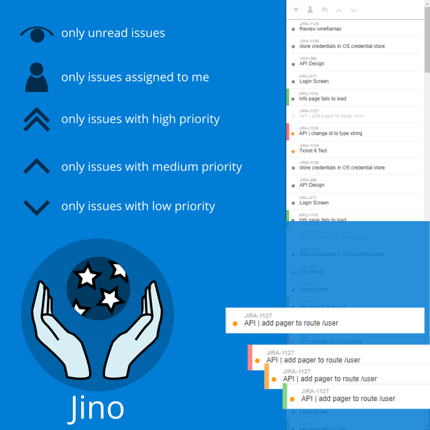

# Jino

# About
Jino is a tool that helps you to keep easy track of your Jira notifications and tickets. It sends a system notification if there is a new ticket and it keeps track of all the tickets you are watching and enables you to keep them in your reading list. It also has the option to priorities tickets within Jino (low, medium, high) and filter them by priority. In order to change the priority, right click on a ticket in teh list. You can also filter by tickets assigned to you or use `Ctrl` + `f` to look for tickets matching a specific key.

# Get started
1. run the portable Jino app
2. enter your Jira server url e.g. my-company.atlassian.net
3. enter your Atlassian username/e-mail
4. create a token by clicking the link on the login page
5. copy the newly created into the token field
6. data will be stored in your user data directory, the token is secured by keytar and not safed in plain text

# Development

To Test
`npm run start`

Build portable EXE
`npm run dist`